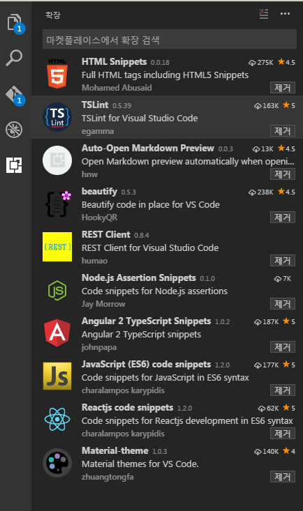

# TensorMSAView 개발환경 설정하기

1. 개발Tool 설치하기 
    - VS Code 설치: https://code.visualstudio.com/docs/?dv=win
    - Extension 설치: 
    
        

2. Cloning TensorMSAView master project
    ~~~
    git clone https://github.com/TensorMSA/TensorMSAView.git
    ~~~

3. Node.JS 및 package manager설치
    - https://nodejs.org/ko/

4. TensorMSAView 프로젝트에 사용되는 Node Package 설치(Node)
    - Change Directory: TensorMSAView\tfmsaview\static
    - 다음의 명령어를 실행하면, 개발에 사용되는 모든 Package가 설치된다.
    ~~~
    $ npm install
    ~~~

5. Node 서버 실행(View개발을 위한 별도 서버)
    ~~~
    D:TensorMSAView\tfmsaview\static> node server.js
    ~~~

6. TensorMSAView 자원 빌드
    - Change Directory: TensorMSAView\tfmsaview\static
    ~~~
    npm run build
    ~~~

7. 화면접속
    - locahhost:8888
